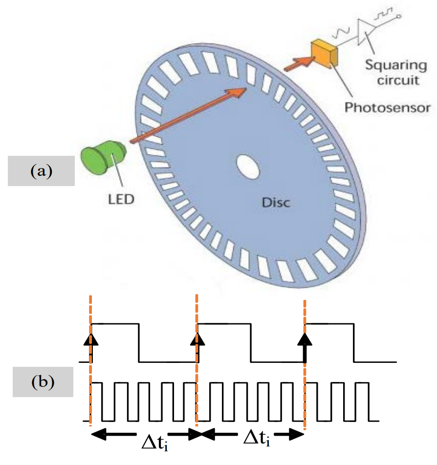

# LAB 3: Interrupts & Timers

**OBJECTIVES**
-	Learn the difference between polling and interrupts
-	Configure and implement hardware Interrupts
-	Configure and implement various Timer
-	Understand how to configure the IR-based sensor & ultrasonic sensor

**EQUIPMENT** 
1.	A laptop that has the Pico C/C++ SDK installed
2.	Raspberry Pico W
3.	Micro-USB Cable
4.	F-F Jumper wire (at least 4)

> [NOTE]
> Only students wearing fully covered shoes are allowed in the SR6A lab due to safety.

## **INTRODUCTION** 

Embedded systems can interact with their surrounding environment in many ways. Whether sensing or actuating, there are two primary mechanisms initiating actions: event-triggered and time-triggered. In this lab, we will first learn how to use interrupts, the building blocks for event-triggered functionality. Lastly, we will build code that uses interrupts that the IR sensor can use as a wheel encoder.

Subsequently, we shall learn how to use time-triggered events known as Timers. A timer is a specialised type of clock used to measure time intervals. A timer that counts from zero upwards for measuring the time elapsed is often called a stopwatch. It is a device that counts down from a specified time interval and generates a time delay. A timer can also be used as a counter that keeps track of the number of times a particular event or process occurred regarding a clock signal. It is used to count the events happening outside the microcontroller. 

## **HARDWARE INTERRUPTS** 

A hardware interrupt is an electronic signal that alerts the microprocessor of an event. An interrupt can be triggered by either an internal peripheral (e.g. timer) or an external device (e.g. button).

In the previous lab session, polling was used to detect when a button was pressed. When polling is used, the microprocessor repeatedly checks whether the event has occurred. In the case of a button, the value of the GPIO pin is read to determine if it is high (unpressed) or low (pressed). Once the button is pressed, the microprocessor detects it quickly since it is always active and does nothing but check this single condition, as shown in Figure 1 (bottom). 

While polling is a simple way to check for state changes, there's a cost. If the checking interval is shorter, there can be a long lag between occurrence and Detection, and you may fail to see the change entirely if the state changes back before you check. A shorter interval will get faster and more reliable Detection and consume more processing time and power since many more checks will return negative.

An alternative is configuring an interrupt on the button's GPIO pin so that an interrupt is generated when a pre-configured trigger condition is met. With this approach, the microprocessor can enter a low-power sleep state and be woken up with the interrupt. The Pico can detect signal changes (e.g. rising or falling edges) to generate an interrupt. If a GPIO pin is configured to be pulled up, a falling edge will occur when the button is pressed, pulling the pin to the ground. Interrupts are thus better suited to handle asynchronous events.

A dedicated or grouped interrupt is triggered, depending on the source of the interrupt. For peripherals like GPIO ports, multiple pins could produce the same interrupt. In these cases, it is necessary to query the pin's interrupt vector register to identify the interrupt's exact source. Typically, this is done inside the ISR. Once an ISR identifies the source of the interrupt, it can react accordingly. Typically, ISRs execute in a privileged mode that can mask other interrupts. Hence, ISR should be as short as possible and only set application-specific flags to indicate to the microprocessor's main thread to execute the corresponding task in response to an interrupt.

## **GPIO INTERRUPT REQUEST**

We will be exploring the [hello_gpio_irq.c](https://github.com/raspberrypi/pico-examples/blob/master/gpio/hello_gpio_irq/hello_gpio_irq.c) sample code designed for the Pico W. In this session, we'll merge our knowledge of GPIO with the concept of interrupts. Instead of the previous lab's approach, where we continuously polled the GPIO pin status using the `while(true)` statement, we'll now integrate interrupts. This will allow us to trigger the interrupts based on the desired state, whether edge-triggered or level-triggered. In this example, edge-triggered has been chosen. How would you change it to level-triggered? 

> [NOTE]
> Switching to trigger at a low-level (GPIO_IRQ_LEVEL_LOW) could lead to the software crashing (not working). Why?

## **IR-BASED WHEEL ENCODER**
 

The working principle of the encoder (shown above) is illustrated in the image below. It uses a slotted wheel with a single LED and photodetector pair that generate pulses as the wheel turns, and the speed of an object can be calculated by measuring the pulse duration Δti  (i.e. elapsed time or period of a pulse) between successive pulses [2]. It comprises three connections: GND, VCC and OUT. GND and VCC supply power to the module (in our case, via the MSP432's GND and 3.3V pins), while OUT generates the square-pulse signal.

## **TIMERS**

The RP2040 found in the Pico features a flexible timer system that can be used for various applications. Here is a brief description of its timer system, focusing on timer modes, input capture, and output compare:

1. **Timer Modes:**
    - **Free Running Mode:** In this mode, the timer simply counts from 0 to its maximum value and then wraps around to start counting again.
    - **Periodic Mode:** In this mode, the timer counts up to a predefined value (ALARM0, for instance) and then restarts from zero. This can be used to generate periodic interrupts or events.
    - **One-Shot Mode:** In this mode, the timer counts up to a predefined value and then stops. It's useful for creating a single delay or measuring an event of known duration.

2. **Input Capture:**
    - Input capture is used to measure the time duration of an external event. For example, it can measure the duration of a pulse on a pin.
    - When the event occurs (like a rising or falling edge on a pin), the current timer value is 'captured' and stored in a register.
    - By comparing consecutive captured values, you can determine the duration of the event or the period between events.
    - The RP2040 timer can be configured to generate an interrupt when such capture occurs, which allows the CPU to process the captured value or take action based on the event.

3. **Output Compare:**
    - Output compare generates an event (like toggling a pin) at a specific timer value.
    - You set a value in a compare register, and an action can be triggered when the timer counts up to that value.
    - The action can be as simple as generating an interrupt or as complex as toggling a GPIO pin, generating PWM signals, etc.
    - This feature can be very useful in applications like motor control, where precise timing of events is crucial.

It's also worth noting that the RP2040 timer system provides multiple alarm (compare) registers, allowing multiple compare values to be active simultaneously. This multi-alarm capability can be particularly useful in applications requiring various events to happen simultaneously without constant CPU intervention. To make full use of the timer capabilities, you should take a look at the RP2040 datasheet and SDK, which will provide more detailed information and examples on how to configure and use the timers.
